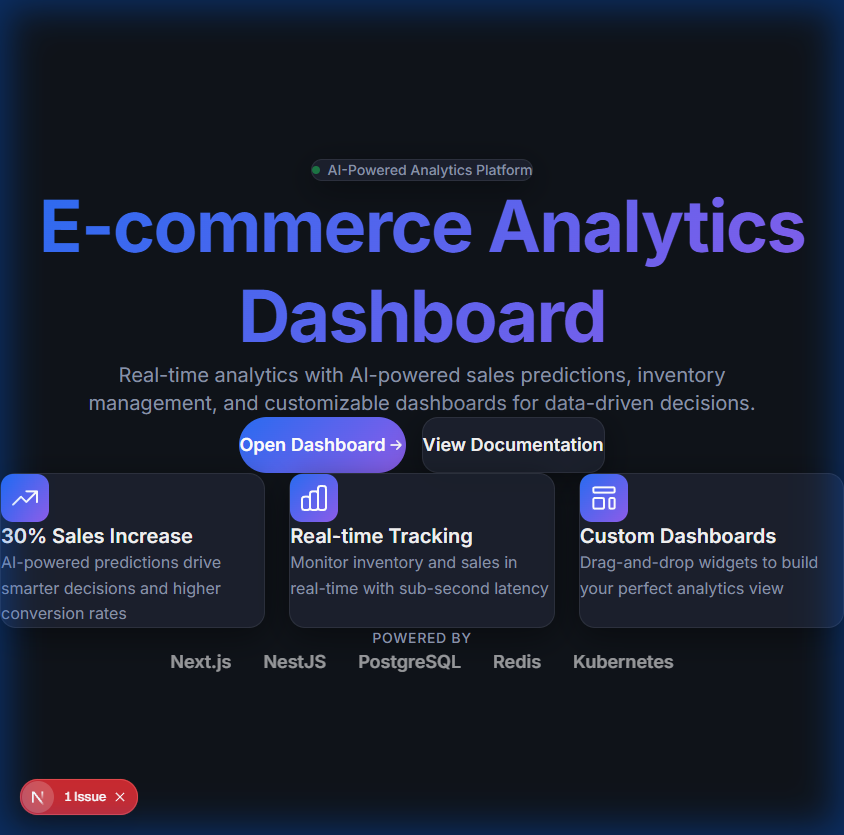
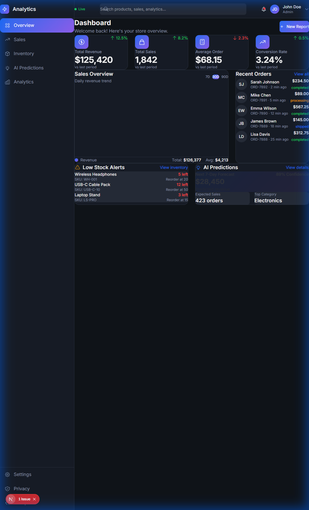
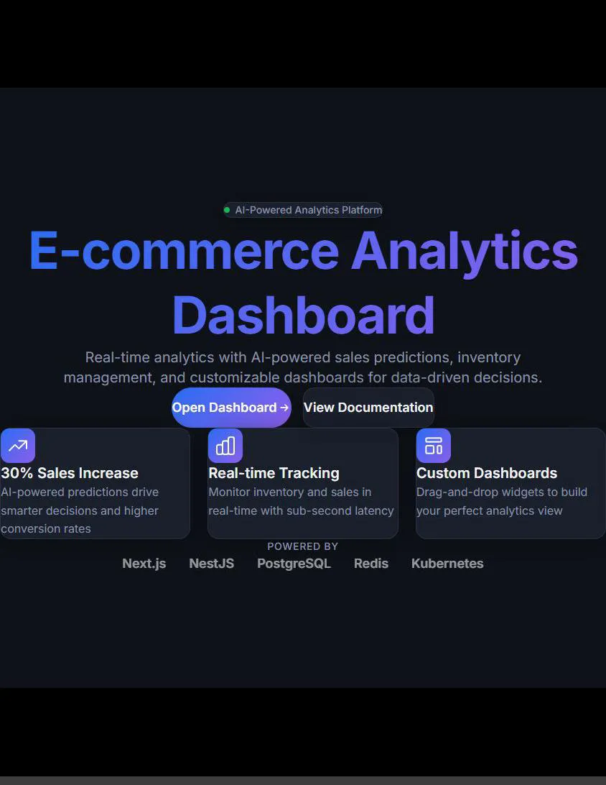

# E-commerce Analytics Dashboard

> Real-time analytics platform for e-commerce businesses with AI-powered sales predictions and inventory management.

[](https://nextjs.org/)
[](https://nestjs.com/)
[](https://postgresql.org/)
[](https://redis.io/)
[](https://kubernetes.io/)

## ✨ Features

- **📊 Real-time Analytics Dashboard** - Monitor sales, revenue, and inventory with sub-second latency
- **🤖 AI-Powered Predictions** - Machine learning models for sales forecasting and inventory optimization
- **📦 Inventory Management** - Real-time stock tracking with automated low-stock alerts
- **🎨 Customizable Dashboards** - Drag-and-drop widgets to build personalized analytics views
- **🔒 GDPR/CCPA Compliant** - Built-in privacy controls for data export, deletion, and consent management
- **⚡ WebSocket Real-time Updates** - Live data streaming for instant dashboard updates

## 🎯 Key Outcomes

| Metric | Target |
|--------|--------|
| Sales Conversion Increase | **30%** |
| Inventory Tracking | **Real-time** (<1s latency) |
| Dashboard Customization | **100%** user personalization |

## � Screenshots

### Landing Page

*Premium landing page with animated gradients, feature highlights, and technology stack showcase*

### Analytics Dashboard

*Real-time dashboard with metrics cards, sales charts, recent orders, low stock alerts, and AI predictions*

### Demo Video

*Interactive demo showing navigation and dashboard features*

## �🛠️ Technology Stack

| Layer | Technology |
|-------|------------|
| **Frontend** | Next.js 14+, TypeScript, Tailwind CSS |
| **Backend** | NestJS, TypeORM, Socket.io |
| **Database** | PostgreSQL 16 |
| **Cache** | Redis 7 |
| **ML Service** | Python, Flask, NumPy, Pandas |
| **Container** | Docker, Docker Compose |
| **Orchestration** | Kubernetes |

## 📁 Project Structure

```
ecommerce-analytics/
├── src/                        # Next.js Frontend
│   ├── app/                    # App Router pages
│   │   ├── dashboard/          # Dashboard pages
│   │   └── ...
│   └── components/             # React components
│       └── dashboard/          # Dashboard-specific components
├── backend/                    # NestJS Backend
│   └── src/
│       ├── modules/
│       │   ├── analytics/      # Real-time analytics
│       │   ├── auth/           # JWT authentication
│       │   ├── cache/          # Redis caching
│       │   ├── inventory/      # Stock management
│       │   ├── predictions/    # AI forecasting
│       │   ├── privacy/        # GDPR compliance
│       │   └── sales/          # Sales data
│       └── common/             # Shared utilities
├── ml-service/                 # Python ML Service
├── k8s/                        # Kubernetes manifests
├── docker-compose.yml          # Local development
└── docs/                       # Documentation
```

## 🚀 Quick Start

### Prerequisites

- Node.js 18+
- Docker & Docker Compose
- PostgreSQL 16 (or use Docker)
- Redis 7 (or use Docker)

### 1. Clone and Install

```bash
# Clone the repository
git clone https://github.com/yourusername/ecommerce-analytics.git
cd ecommerce-analytics

# Install frontend dependencies
npm install

# Install backend dependencies
cd backend && npm install && cd ..
```

### 2. Environment Setup

```bash
# Copy environment files
cp backend/env.example backend/.env

# Edit .env with your configuration
# See env.example for all options
```

### 3. Start with Docker Compose (Recommended)

```bash
# Start all services
docker-compose up -d

# View logs
docker-compose logs -f
```

### 4. Or Start Manually

```bash
# Terminal 1: Start PostgreSQL and Redis
docker run -d -p 5432:5432 -e POSTGRES_PASSWORD=postgres postgres:16-alpine
docker run -d -p 6379:6379 redis:7-alpine

# Terminal 2: Start backend
cd backend && npm run start:dev

# Terminal 3: Start frontend
npm run dev

# Terminal 4: Start ML service
cd ml-service && python app.py
```

### 5. Access the Application

- **Frontend Dashboard:** http://localhost:3000
- **Backend API:** http://localhost:4000
- **API Documentation:** http://localhost:4000/api/docs
- **ML Service:** http://localhost:5000

## 📖 API Documentation

The API is documented with Swagger/OpenAPI. Access the documentation at:

```
http://localhost:4000/api/docs
```

### Key Endpoints

| Method | Endpoint | Description |
|--------|----------|-------------|
| POST | `/api/auth/register` | Register new user |
| POST | `/api/auth/login` | User login |
| GET | `/api/analytics/dashboard` | Get dashboard metrics |
| GET | `/api/sales` | List sales with pagination |
| GET | `/api/sales/metrics` | Get sales metrics |
| GET | `/api/inventory/products` | List products |
| GET | `/api/predictions/forecast` | Get AI predictions |
| GET | `/api/privacy/export` | Export user data (GDPR) |

## ☸️ Kubernetes Deployment

```bash
# Apply all manifests
kubectl apply -f k8s/

# Check deployments
kubectl get pods

# Check services
kubectl get services

# View HPA status
kubectl get hpa
```

## 🧪 Testing

```bash
# Frontend tests
npm run test

# Backend tests
cd backend && npm run test

# E2E tests
npm run test:e2e
```

## 📊 Performance Targets

| Metric | Target |
|--------|--------|
| Dashboard Load Time | < 2 seconds |
| Real-time Update Latency | < 1 second |
| API Response Time (95th) | < 200ms |
| System Uptime | 99.9% |

## 🔐 Security & Compliance

- **Authentication:** JWT-based with secure token management
- **Authorization:** Role-based access control (RBAC)
- **Data Encryption:** TLS 1.3 in transit, encrypted at rest
- **GDPR Compliance:** Data export, deletion, consent management
- **CCPA Compliance:** Privacy rights dashboard

## 🤝 Contributing

1. Fork the repository
2. Create a feature branch (`git checkout -b feature/amazing-feature`)
3. Commit changes (`git commit -m 'Add amazing feature'`)
4. Push to branch (`git push origin feature/amazing-feature`)
5. Open a Pull Request

## 📄 License

This project is licensed under the MIT License - see the [LICENSE](LICENSE) file for details.

---

Built with ❤️ by Jay Arre P. Talosig for data-driven e-commerce success
